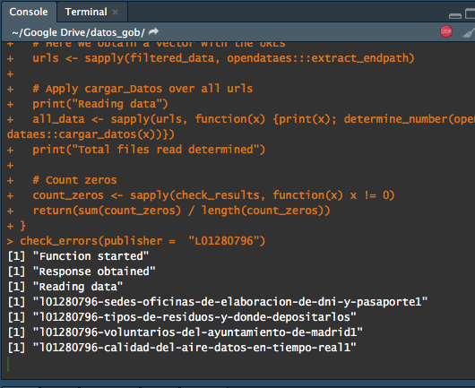

```{r, echo = FALSE}
# knitr::opts_chunk$set(eval = FALSE)
```


## Hace mucho tiempo....

Queriamos hacer una liberia para acceder los datos de Barcelona: [http://opendata-ajuntament.barcelona.cat/](http://opendata-ajuntament.barcelona.cat/)

Después Madrid... [https://datos.madrid.es/](https://datos.madrid.es/)

Después Sevilla... [https://datosabiertos.sevilla.org/](https://datosabiertos.sevilla.org/)

Que? Y cuantas ciudades están publicando sus datos? CASI TODAS!

## datos.gob.es

- [datos.gob.es](https://datos.gob.es) es un agregador de datos de instituciones públicas en España

- Estos datos incluyen información a nivel estatal, pero también autonómico y local.

- Estamos hablando de alrededor de 19.000 datasets de temas como economía, contaminación, etc..

Por suerte.... TIENE UNA API!

## datos.gob.es

Yo creo que todavía no entienden la magnitud de los datos....


## datos.gob.es

No, en serio....


## opendataes

- `opendataes` es un paquete que pretende interactuar con la API de [datos.gob.es](https://datos.gob.es).

- Pertence al grupo de paquetes [rOpenSpain](https://ropenspain.es/):


Y como funciona? Veamos un ejemplo.

## opendataes - Demo


## opendataes - Ejemplo

[http://datos.gob.es/es/catalogo/l01080193-elecciones-al-parlamento-europeo-sobre-electores](http://datos.gob.es/es/catalogo/l01080193-elecciones-al-parlamento-europeo-sobre-electores)

```{r, eval = FALSE}
remotes::install_github("ropenspain/opendataes") # Instalamos el paquete
```


```{r}
library(opendataes)
path_id <- "l01080193-elecciones-al-parlamento-europeo-sobre-electores" # End path de la URL
elections <- cargar_datos(path_id, encoding = 'latin1') # Leemos los datos

elections
```

## ¿Qué devuelve `cargar_datos`? (I)

```{r}
elections$metadata
```

## ¿Qué devuelve `cargar_datos`? (II)

```{r}
head(elections$data[[1]], 5)
```


## Que puedo leer?

- `opendataes` es un proyecto muy ambicioso pero con muchas limitaciones.
- Solo se pueden los publishers que están en `publishers_available`.

```{r}
publishers_available
```

- Solo se pueden leer los formatos que están en `permitted_formats`.

```{r}
permitted_formats
```

Porque estas grandes limitaciones?

## opendataes: workflow


## opendataes se puede escalar?

Puedo leer muchos datos juntos? Si! `opendataes` te permite explorar los datos a través de R.

- En primer lugar, vemos los publicadores disponibles a través de `publishers_available`. Filtramos por el Ayto. de Barcelona y exploramos los *keywords*:

```{r}
pb_code <- publishers_available$publisher_code[publishers_available$publishers ==
                                                 'Ayuntamiento de Barcelona']
kw <- explorar_keywords('elecciones', pb_code)
head(kw, 3)
```


## opendataes se puede escalar? (continuación)

- `cargar_datos` requiere de un dataframe con solo una fila, por lo que tendremos que seleccionar solo aquella fila que deseamos:

```{r}
final_dt <- kw[grepl("Elecciones Locales. Absolutos", kw$description), ]
elections <- cargar_datos(final_dt, encoding = 'latin1')
elections
```

## ¿Qué devuelve `cargar_datos`? (I)

1\. Los datos (si pudieron ser leídos).

```{r}
head(elections$data[[1]], 5)
```

## ¿Qué devuelve `cargar_datos`? (II)

2\. Metadata relativa a los mismos.

```{r}
elections$metadata
```

## Colaboración

- ¡Este paquete está plenamente abierto a colaboración!
- Nuestra idea es que el package paulatinamente lea archivos de más publicadores y en más formatos.

- Como colaboro? [https://github.com/ropenspain/opendataes](https://github.com/ropenspain/opendataes)
- Leer **ambos** vignettes en la página del paquete: [https://ropenspain.github.io/opendataes/](https://ropenspain.github.io/opendataes/)
- Abrir issues en la página de Github: [https://github.com/ropenspain/opendataes/issues](https://github.com/ropenspain/opendataes/issues)
- Clonar el paquete desde GH y hacer un pull request: [https://github.com/ropenspain/opendataes/pulls](https://github.com/ropenspain/opendataes/pulls)

## Estamos live!

Estamos intentando leer todos los datos de Madrid y Murcia para incluirlos como publishers!


