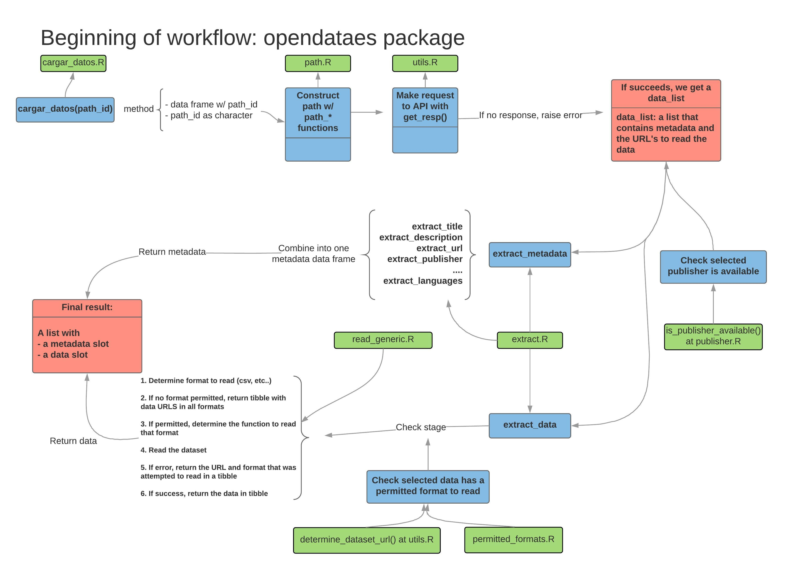
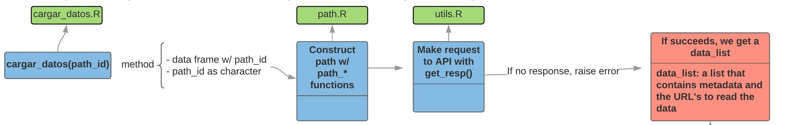
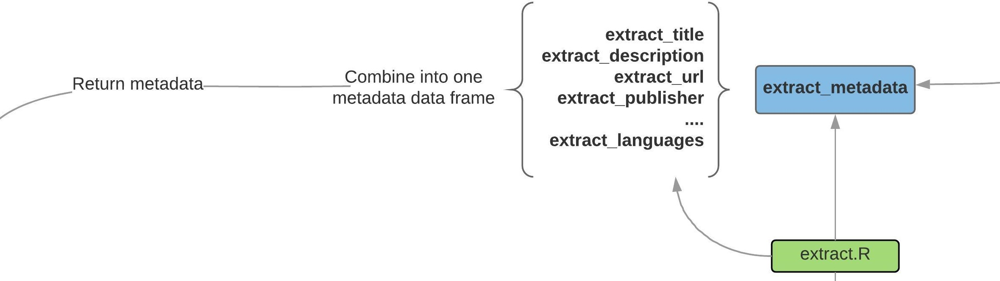
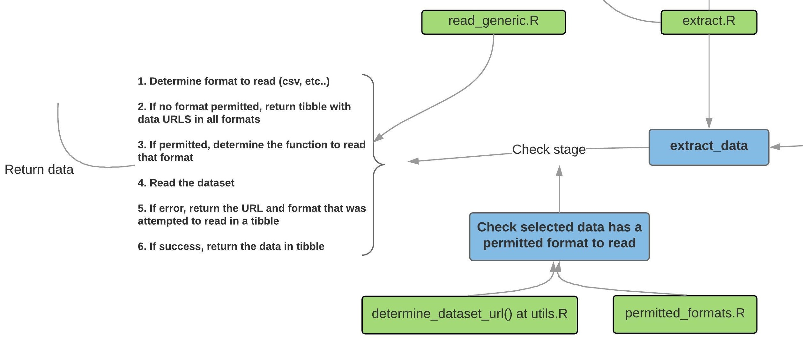
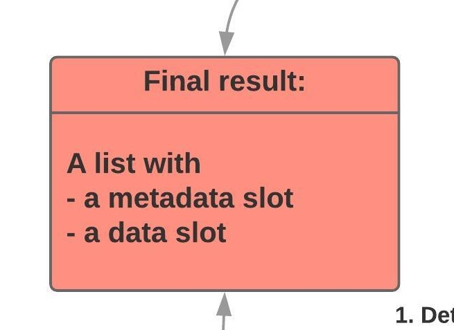
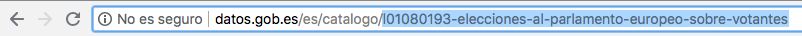

## Introducción (I): opendataes y datos.gob.es. Antecedentes

- [datos.gob.es](https://datos.gob.es) es un agregador de datos de instituciones públicas en España y tiene su origen en la [iniciativa Aporta](http://datos.gob.es/es/acerca-de-la-iniciativa-aporta), promovido por el Ministerio de Economía, con el fin de promocionar la apertura y reutilización de la información del sector público.
- Estos datos incluyen información a nivel estatal, pero también autonómico y local.
- En total, hay disponibles alrededor de 19.000 datasets.
- `opendataes` es un paquete que pretende interactuar con la API de [datos.gob.es](https://datos.gob.es).

## Introducción (II): Limitaciones

- En los inicios del desarrollo del paquete, se ambicionó con poder leer datos de cualquier institución y casi en cualquier formato.
- Como suele ocurrir, la realidad no siempre casa con el deseo.
- Se decidió que para disponer de un *working package* tendríamos que ser conservadores y sentar las bases para que paquete vaya creciendo paulatinamente y de forma sólida.
- Ahora mismo se leen ficheros en formato *csv* (ver `permitted_formats`) y del Ayuntamiento de Barcelona (ver `publishers_available`), que nos permite asegurar la estandarización de los datos.
- Es por ello que...

## Introducción (III): Colaboración

- ¡Este paquete está plenamente abierto a colaboración! 
- Está pensado para ser desarrollado por la comunidad R. Cualquier idea, sugerencia y mejora es altamente apreciada.
- Nuestra idea es que el package paulatinamente lea archivos de más publicadores y en más formatos.

Como colaboro? [https://github.com/cimentadaj/opendataes](https://github.com/cimentadaj/opendataes)

## opendataes: workflow



## opendataes: Llamadas a la API



## opendataes: Extraer metadata



## opendataes: Extraer datos



## opendataes: Resultado final



## Instalación y uso básico

- Actualmente el paquete se encuentra bajo testeo y no se puede descargar desde CRAN.

```{r, eval = FALSE, warning = FALSE, message = FALSE, echo=TRUE}
remotes::install_github("cimentadaj/opendataes")
```

- La principal función del paquete es `cargar_datos`, que permite cargar datos desde la API de [datos.gob.es](https://datos.gob.es). Esta función puede ser utilizada de dos formas:

1. Búsqueda a través de la web:



2. Exploración a través de R: Alternativamente, `opendataes` permite realizar la búsqueda por *keywords*. 

## Exploración a través de R

- En primer lugar, vemos los publicadores disponibles a través de `publishers_available`. Filtramos por el Ayto. de Barcelona y exploramos los *keywords*:

```{r}
library(opendataes)

pb_code <- publishers_available$publisher_code[publishers_available$publishers ==
                                                 'Ayuntamiento de Barcelona']

kw <- explorar_keywords('elecciones', pb_code)
head(kw, 3)
```


## Exploración a través de R (continuación)

- Una vez tenemos el dataframe con la descripción, `cargar_datos` requiere de un dataframe con solo una fila, por lo que tendremos que seleccionar solo aquella fila que deseamos:

```{r}
final_dt <- kw[grepl("Elecciones Locales. Absolutos", kw$description), ]
elections <- cargar_datos(final_dt, encoding = 'latin1')
```

## ¿Qué devuelve `cargar_datos`? (I)

- El output de esta función es una lista que se define con clase `datos_gob_es`. Esta lista contiene dos slots:

1\. Los datos (si pudieron ser leídos).

```{r}
head(elections$data[[1]], 5)
```

## ¿Qué devuelve `cargar_datos`? (II)

2\. Metadata relativa a los mismos.

```{r}
elections$metadata
```

## Exploración a través de la web

```{r}
path_id <- "l01080193-elecciones-al-parlamento-europeo-sobre-electores"
elections <- cargar_datos(path_id, encoding = 'latin1')

elections
```

## ¿Qué devuelve `cargar_datos`? (I)

```{r}
elections$metadata
```

## ¿Qué devuelve `cargar_datos`? (II)

```{r}
head(elections$data[[1]], 5)
```

## Como colaborar?

- Leer **ambos** vignettes en la página del paquete: [https://cimentadaj.github.io/opendataes/](https://cimentadaj.github.io/opendataes/)
- Abrir issues en la página de Github: [https://github.com/cimentadaj/opendataes/issues](https://github.com/cimentadaj/opendataes/issues)
- Clonar el paquete desde GH y hacer un pull request: [https://github.com/cimentadaj/opendataes/pulls](https://github.com/cimentadaj/opendataes/pulls)

**Queremos que el paquete sea mantenido por la comunidad, cualquier iniciativa es muy bienvenida**

